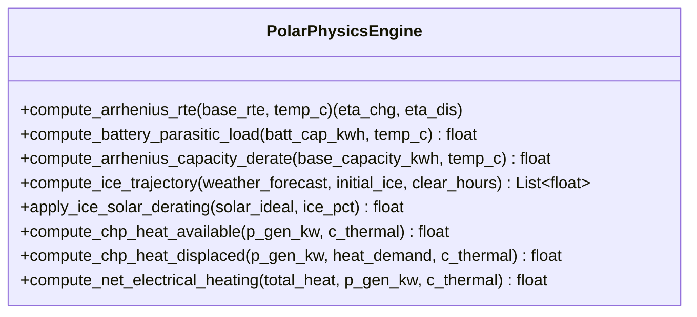
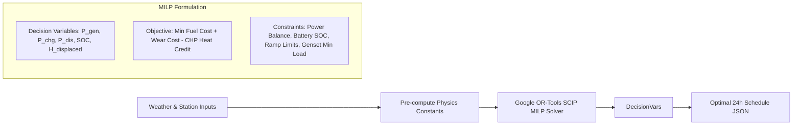
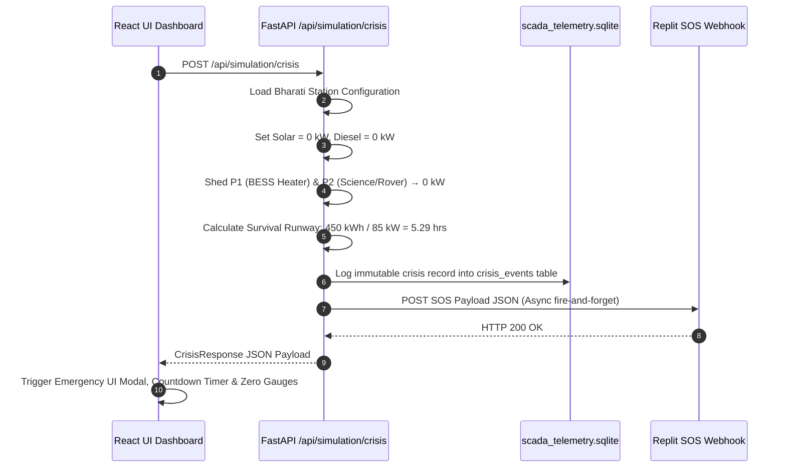
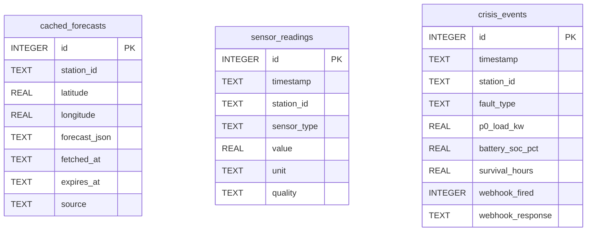
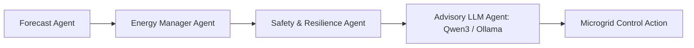

# POLARIS Architecture Schema v4.0

## AI-Driven Smart Energy Management System & Digital Twin for Polar Research Stations
### Smart India Hackathon 2026 — Problem Statement PS26061

---

## 1. System Overview & Core Concept

**POLARIS** is an edge-resilient, AI-driven microgrid energy management system and 3D digital twin designed specifically for extreme polar environments (Antarctic and Arctic research stations like Bharati, Maitri, Himadri, and Dakshin Gangotri).

### System Operational Cycle (CONOPS)
```
  ┌──────────┐     ┌──────────┐     ┌──────────┐     ┌──────────┐     ┌──────────┐     ┌──────────┐
  │ OBSERVE  │ ──> │ PREDICT  │ ──> │ SIMULATE │ ──> │ OPTIMIZE │ ──> │ VALIDATE │ ──> │   ACT    │
  └──────────┘     └──────────┘     └──────────┘     └──────────┘     └──────────┘     └──────────┘
  Live SCADA &     Solar/Load       Dual-Track       Google OR-       Physics &        BESS & Genset
  Sensors          AI Forecasting   Digital Twin     MILP Solver      Safety Checks    Dispatch
```

---

## 2. Complete Project Directory Structure

```
Master_Polaris/
├── architecture_schema.md             ← THIS FILE (Single Source of Truth v4.0)
├── architecture_schema_v3.md          ← Legacy Version Reference
│
├── backend/
│   ├── main.py                        # FastAPI entrypoint — CORS & REST/WS router registration
│   ├── requirements.txt               # Dependencies (fastapi, uvicorn, ortools, httpx, sqlite3, pydantic)
│   ├── .env.example                   # Environment variables (REPLIT_WEBHOOK_URL, OLLAMA_HOST)
│   │
│   ├── api/                           # REST & WebSocket API endpoints
│   │   ├── station.py                 # GET /api/station/presets, POST /api/station/calculate-state
│   │   ├── weather.py                 # GET /api/weather/live (Open-Meteo API & Edge Cache)
│   │   ├── forecast.py                # POST /api/forecast/run (Solar & Load AI prediction)
│   │   ├── optimization.py            # POST /api/optimization/solve (OR-Tools MILP schedule)
│   │   ├── simulation.py              # POST /api/simulation/run, WS /api/simulation/ws/stream
│   │   ├── crisis.py                  # POST /api/simulation/crisis (Catastrophic Crisis & SOS)
│   │   └── agents.py                  # POST /api/agents/orchestrate (Multi-agent AI cycle)
│   │
│   ├── database/                      # Data persistence & edge resilience
│   │   ├── db.py                      # Primary SQLite connection (polaris.db)
│   │   ├── schema.py                  # Operational database table definitions
│   │   └── edge_db.py                 # Edge-deployed resilient SQLite layer
│   │
│   ├── data/                          # Data files & SQLite databases
│   │   ├── polaris.db                 # Primary operational database
│   │   ├── weather_cache.sqlite       # Edge DB: Cached weather forecasts with TTL
│   │   ├── scada_telemetry.sqlite     # Edge DB: SCADA sensor logs & immutable crisis log
│   │   ├── historical_telemetry.csv   # 15,000+ synthetic katabatic edge-case telemetry records
│   │   └── station_presets.py         # Polar station configurations (Bharati, Maitri, etc.)
│   │
│   ├── physics/                       # Polar Physics Engine (Pure Side-Effect-Free Functions)
│   │   └── polar_physics.py           # Arrhenius RTE decay, Rime ice accumulator, CHP coupling
│   │
│   ├── optimization/                  # Mathematical MILP Dispatch Engine
│   │   └── energy_optimizer.py        # Google OR-Tools SCIP MILP solver & heuristic fallback
│   │
│   ├── forecasting/                   # AI Forecasting Pipeline
│   │   ├── solar_forecast.py          # Physics-informed solar irradiance & PV prediction
│   │   └── load_forecast.py           # Thermal & electrical baseline load forecaster
│   │
│   ├── simulation/                    # Dual-Track Digital Twin Simulation
│   │   ├── engine.py                  # Sequential comparison engine (Baseline SCADA vs POLARIS AI)
│   │   └── scenarios.py               # Disaster & extreme storm scenario definitions
│   │
│   ├── agents/                        # Multi-Agent AI Orchestration
│   │   └── orchestrator.py            # Forecast, Energy Manager, Safety & Qwen3 LLM Agents
│   │
│   ├── services/                      # Service Layer & Synthetic Telemetry Generators
│   │   ├── data_validator.py          # Telemetry range & quality check service
│   │   ├── load_service.py            # Station load calculation service
│   │   ├── solar_service.py           # Solar irradiance & shading service
│   │   ├── optimizer_service.py       # Wrapper service for energy optimizer
│   │   └── synthetic_telemetry_engine.py # Synthetic SCADA generator for polar edge-cases
│   │
│   └── scripts/                       # Database initialization & generation scripts
│       └── generate_synthetic_telemetry.py # Telemetry database seeder
│
└── frontend/
    ├── src/
    │   ├── App.tsx                    # Root React component — routing & state management
    │   ├── main.tsx                   # Vite application entrypoint
    │   ├── index.css                  # Tailwind CSS global styling
    │   │
    │   ├── api/
    │   │   └── client.ts              # REST API client & Axios/Fetch wrappers
    │   │
    │   ├── components/                # React Dashboard UI Components
    │   │   ├── Header.tsx             # Navigation header & resilience indicator
    │   │   ├── CurrentEnergyCard.tsx  # Microgrid KPI cards & Crisis countdown timer
    │   │   ├── LoadManagement.tsx     # P0/P1/P2 priority load shedding UI table
    │   │   ├── EnergyFlow.tsx         # Real-time Sankey energy flow diagram
    │   │   ├── DigitalTwin.tsx        # 3D canvas render of polar station
    │   │   ├── SimulationControls.tsx # Dual-track simulation playback controls
    │   │   ├── BaselineComparison.tsx # Baseline vs POLARIS AI metric comparisons
    │   │   ├── AgentActivity.tsx      # Multi-agent decision feed log
    │   │   ├── ForecastChart.tsx      # Solar & load prediction timelines
    │   │   ├── WeatherPanel.tsx       # Live atmospheric & katabatic telemetry
    │   │   ├── StationMap.tsx         # Interactive Leaflet Antarctic map
    │   │   ├── StationConfig.tsx      # Equipment & fuel configuration controls
    │   │   ├── OptimizationTimeline.tsx # 24h optimal dispatch schedule
    │   │   ├── ExplainabilityModal.tsx # AI decision transparency modal
    │   │   ├── FinalReportModal.tsx   # Simulation run summary report
    │   │   ├── DataSourcesFooter.tsx  # Data lineage & pipeline specs
    │   │   └── PolarisDashboard.tsx    # Live WebSocket SCADA telemetry dashboard
    │   │
    │   ├── pages/
    │   │   ├── Dashboard.tsx          # Real-time control & crisis tab
    │   │   ├── Simulation.tsx         # Digital twin simulation tab
    │   │   └── Forecast.tsx           # AI forecast & optimization tab
    │   │
    │   ├── store/
    │   │   └── usePolarisStore.ts     # Zustand global store & WebSocket handler
    │   │
    │   └── types/
    │       └── index.ts               # TypeScript types & API response contracts
    │
    ├── index.html                     # HTML index template
    ├── vite.config.ts                 # Vite bundler configuration
    ├── tailwind.config.js             # Tailwind CSS configuration
    ├── postcss.config.js              # PostCSS plugins
    ├── tsconfig.json                  # TypeScript compiler configuration
    └── package.json                   # Frontend dependencies & scripts
```

---

## 3. High-Level Component & Layer Architecture

```mermaid
graph TD
    subgraph Frontend Layer [React 18 / TypeScript / Vite]
        UI[Polaris Dashboard Pages]
        Store[Zustand Store: usePolarisStore]
        ApiClient[API Client: client.ts]
        3DTwin[3D DigitalTwin Canvas]
    end

    subgraph Backend API Layer [FastAPI / Uvicorn]
        RouterStation[Station Router /api/station]
        RouterWeather[Weather Router /api/weather]
        RouterForecast[Forecast Router /api/forecast]
        RouterOpt[Optimization Router /api/optimization]
        RouterSim[Simulation Router /api/simulation]
        RouterCrisis[Crisis Router /api/simulation/crisis]
        RouterAgents[Agents Router /api/agents]
    end

    subgraph Core Physics & AI Engines [Python Engines]
        PhysicsEngine[Polar Physics Engine: Arrhenius + Rime Ice + CHP]
        OptimizerEngine[Google OR-Tools MILP Solver: SCIP]
        Forecaster[AI Solar & Load Forecasters]
        AgentOrchestrator[Multi-Agent Orchestrator: Qwen3 / Ollama]
        DualTrackEngine[Dual-Track Simulation Engine]
    end

    subgraph Edge Resilience & Persistence Layer [SQLite]
        PrimaryDB[(polaris.db)]
        WeatherCache[(weather_cache.sqlite)]
        ScadaDB[(scada_telemetry.sqlite)]
    end

    subgraph External Systems & Services
        OpenMeteo[Open-Meteo Weather API]
        SOSWebhook[Replit SOS Webhook Endpoint]
    end

    UI <--> Store
    Store <--> ApiClient
    ApiClient <--> Backend API Layer

    RouterStation --> Core Physics & AI Engines
    RouterWeather --> WeatherCache
    RouterWeather --> OpenMeteo
    RouterForecast --> Forecaster
    RouterOpt --> OptimizerEngine
    RouterSim --> DualTrackEngine
    RouterCrisis --> ScadaDB
    RouterCrisis --> SOSWebhook
    RouterAgents --> AgentOrchestrator

    Core Physics & AI Engines --> PhysicsEngine
    Core Physics & AI Engines --> PrimaryDB
    DualTrackEngine --> ScadaDB
```

---

## 4. Phase 2 Polar Physics Engine Details

The POLARIS Physics Engine (`backend/physics/polar_physics.py`) provides pure, side-effect-free physics functions used consistently across both the sequential simulation engine and the mathematical optimizer.



### 1. Arrhenius Battery Derating
- **Physics**: Li-ion internal resistance increases exponentially below $-10^\circ\text{C}$.
$$\text{RTE}_{\text{adj}} = \text{RTE}_{\text{base}} \cdot e^{\alpha (T - T_{\text{ref}})} \quad \text{for } T < -10^\circ\text{C} \quad (\alpha = 0.025)$$
- **Parasitic Heating**: BMS thermal management heating blankets activate below $-20^\circ\text{C}$, consuming $0.5\%$ of battery capacity per hour ($3.0\text{ kW}$ for a $600\text{ kWh}$ BESS bank).

### 2. Rime Ice Accretion Accumulator
- **Accretion Model**: Driven by katabatic winds ($\ge 15\text{ km/h}$) and relative snowfall.
$$\Delta \text{Ice} = \left(\frac{v_{\text{wind}}}{100}\right) \times (1 + 2 \cdot \text{Snowfall}) \times 8.0 \quad [\%/\text{hr}]$$
- **Solar Derating**: Up to $85\%$ solar blockage at $100\%$ ice coverage ($15\%$ diffuse light passes through).

### 3. Combined Heat & Power (CHP) Coupling
- **Thermal Recovery**: Diesel generator produces recoverable waste heat from jacket coolant and exhaust.
$$Q_{\text{recoverable}} = P_{\text{generator}} \times 1.3 \quad [\text{kW}_{\text{thermal}}/\text{kW}_{\text{electrical}}]$$
- **Heating Displacement**: Displaces electrical habitat heating load, directly reducing diesel fuel consumption.

---

## 5. Google OR-Tools MILP Energy Optimizer

The optimizer (`backend/optimization/energy_optimizer.py`) solves optimal microgrid unit commitment and dispatch over $24\text{h}$ or $72\text{h}$ horizons.



### Objective Function
$$\min \sum_{t=1}^{T} \left( C_{\text{fuel}} \cdot P_{\text{gen}}[t] + C_{\text{wear}}(T[t]) \cdot P_{\text{dis}}[t] - C_{\text{CHP}} \cdot H_{\text{displaced}}[t] \right)$$

---

## 6. Catastrophic Crisis & Emergency SOS Workflow

### Load Shedding Priority Hierarchy
| Priority Tier | Load Category | Description | Shedding Protocol | Bharati Preset Load |
|---|---|---|---|---|
| **P0** | Life Support | Habitat thermal, satellite communications, air/water scrubbers | **NEVER SHED** — Powered until battery depletion | 85.0 kW |
| **P1** | BESS Heating | Battery thermal management parasitic heater | **SHED FIRST** — Sacrifices battery degradation for human life | 15.0 kW |
| **P2** | Science & Rover | High-performance computing, science labs, rover charging | **SHED IMMEDIATELY** — Set to 0 kW in grid emergency | 127.0 kW |

### Thermal Death Runway Calculation
$$\text{Survival Hours} = \frac{\text{Battery Available Energy (kWh)}}{\text{P0 Load (kW)}} = \frac{600\text{ kWh} \times 0.75}{85.0\text{ kW}} = 5.29\text{ Hours } (5\text{h } 17\text{m})$$

### Crisis Execution Flow Sequence Diagram



### SOS Webhook JSON Payload Schema
```json
{
  "status": "CRITICAL_SOS",
  "station": "Bharati",
  "fault": "Total Generation Failure",
  "p0_exergy_remaining_hours": 5.29,
  "timestamp": "2026-09-05T09:38:00Z",
  "battery_soc_pct": 75.0,
  "p0_load_kw": 85.0,
  "battery_energy_kwh": 450.0
}
```

---

## 7. Edge-Deployed SQLite Resilience Layer

POLARIS implements a 3-tier SQLite storage topology to guarantee mission-critical reliability during satellite blackouts.



1. **Primary Database (`polaris.db`)**: Holds long-term station state, preset configurations, and historical baseline runs.
2. **Weather Cache Edge DB (`weather_cache.sqlite`)**: Caches Open-Meteo hourly weather forecasts with expiration TTL to maintain offline forecast capability.
3. **SCADA Telemetry Edge DB (`scada_telemetry.sqlite`)**: High-frequency sensor logger and immutable ledger for emergency crisis events.

---

## 8. Multi-Agent AI Orchestration

POLARIS features a 4-agent autonomous swarm (`backend/agents/orchestrator.py`):



1. **Forecast Agent**: Evaluates katabatic wind trends, solar irradiance, and rime ice buildup.
2. **Energy Manager Agent**: Calls the OR-Tools MILP optimizer to generate candidate microgrid schedules.
3. **Safety & Resilience Agent**: Enforces hard battery SOC bounds, generator ramp rates, and P0 life-support reservations.
4. **Advisory LLM Agent**: Provides natural-language explainability and operational recommendations powered by an edge-deployed Qwen3 model.

---

## 9. AI Pipeline & Model Specifications

| Parameter | Value / Specification |
|---|---|
| **Training Corpus** | 15,000+ Synthetic Katabatic Edge-Case Records |
| **Optimization Engine** | Google OR-Tools MILP (SCIP Solver) |
| **Weather Telemetry** | Open-Meteo High-Resolution Atmospheric API |
| **Physics Engines** | Arrhenius Battery Decay + Rime Ice Accumulator + CHP Thermal Recovery |
| **Edge Advisory Model** | Qwen3:8B via Ollama |
| **Edge Storage** | 3× Resilient SQLite Layer |

---

*Document Version: 4.0 — Complete Single Source of Truth Architecture Schema*  
*Last Updated: September 2026*  
*Project: POLARIS — AI Polar Energy Resilience Platform & Digital Twin*  
*Problem Statement: Smart India Hackathon 2026 PS26061*
