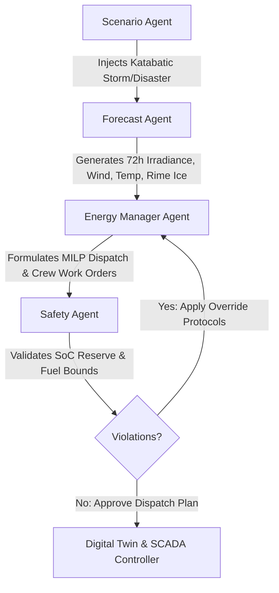
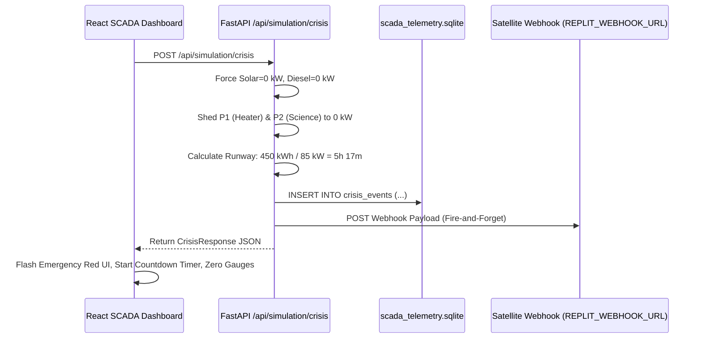

# POLARIS Architecture Schema v3.0

## AI-Driven Smart Energy Management System & Digital Twin for Polar Research Stations
### Smart India Hackathon 2026 — Problem Statement PS26061

---

## 1. Executive Summary & Core Philosophy

**POLARIS** is an AI-driven, physics-informed microgrid energy management system and digital twin engineered specifically for edge-deployed polar research stations (e.g., Bharati, Maitri in Antarctica, Himadri in the Arctic).

POLARIS operates on the closed-loop paradigm:
$$\text{Observe} \longrightarrow \text{Predict} \longrightarrow \text{Simulate} \longrightarrow \text{Optimize} \longrightarrow \text{Validate} \longrightarrow \text{Act}$$

### Key Innovations:
1. **Polar Physics Integration (PINN Principles)**: Directly accounts for sub-zero battery Arrhenius degradation, dynamic rime-ice accretion on solar arrays, and Combined Heat & Power (CHP) thermal-electrical coupling.
2. **Proactive Google OR-Tools MILP**: Replaces naive reactive SCADA threshold logic with multi-period rolling-horizon Mixed-Integer Linear Programming.
3. **Multi-Agent Explainability Framework**: 4 specialized agents (Scenario, Forecast, Energy Manager, Safety) reasoning in tandem with human-in-the-loop work orders.
4. **Catastrophic Crisis & Edge Resilience**: Local-first 3× SQLite persistence, automatic P0/P1/P2 load hierarchy shedding, thermal death exergy countdown, and asynchronous SOS satellite webhook telemetry.

---

## 2. Project Directory Structure

```
Polaris_Latest/
├── architecture_schema_v3.md          ← Master Architecture Schema (Single Source of Truth)
│
├── backend/
│   ├── main.py                        # FastAPI entrypoint — registers all REST & WS routers
│   ├── requirements.txt               # Backend dependencies (fastapi, uvicorn[standard], websockets, ortools, etc.)
│   ├── .env.example                   # Environment configuration (REPLIT_WEBHOOK_URL, OPEN_METEO_API_KEY)
│   │
│   ├── api/                           # REST & WebSocket API Layer
│   │   ├── station.py                 # GET /api/station/presets, POST /api/station/calculate-state
│   │   ├── weather.py                 # GET /api/weather/live
│   │   ├── forecast.py                # POST /api/forecast/run
│   │   ├── optimization.py            # POST /api/optimization/solve
│   │   ├── simulation.py              # POST /api/simulation/run, WS /api/simulation/ws/stream
│   │   ├── crisis.py                  # POST /api/simulation/crisis (Catastrophic Survival Mode)
│   │   └── agents.py                  # POST /api/agents/orchestrate
│   │
│   ├── physics/
│   │   └── polar_physics.py           # Core polar physics equations (Arrhenius, Rime Ice, CHP, Heaters)
│   │
│   ├── optimization/
│   │   └── energy_optimizer.py        # Google OR-Tools SCIP MILP Solver
│   │
│   ├── forecasting/                   # AI Forecasting Pipeline
│   │   ├── solar_forecast.py          # 72-hour solar irradiance & generation forecast
│   │   └── load_forecast.py           # Gradient Boosting Regressor station demand forecast
│   │
│   ├── simulation/                    # Digital Twin Simulation Engines
│   │   ├── engine.py                  # Dual-track runner (Baseline SCADA vs Polaris AI)
│   │   └── scenarios.py               # Disaster scenarios (Polar Storm, Generator Failure, Extreme Cold)
│   │
│   ├── agents/                        # Multi-Agent Orchestration
│   │   └── orchestrator.py            # PolarisAgentOrchestrator (Scenario, Forecast, Energy Mgr, Safety)
│   │
│   ├── database/                      # Data Persistence Layer
│   │   ├── db.py                      # Primary SQLite connection (polaris.db)
│   │   ├── schema.py                  # Core schema: stations, telemetry, data quality
│   │   └── edge_db.py                 # Edge resilience layer (weather_cache & scada_telemetry)
│   │
│   ├── services/                      # Business & Utility Services
│   │   ├── weather_service.py         # Open-Meteo atmospheric integration & caching
│   │   ├── solar_service.py           # Solar geometry & PV power profile generation
│   │   ├── load_service.py            # Thermal & electrical demand aggregators
│   │   ├── optimizer_service.py       # High-level solver invocation wrapper
│   │   ├── data_validator.py          # Telemetry anomaly & plausibility checker
│   │   └── synthetic_telemetry_engine.py # Synthetic sensor noise & katabatic stream generator
│   │
│   ├── data/
│   │   ├── polaris.db                 # Primary SQLite operational database
│   │   ├── weather_cache.sqlite       # Edge DB: Cached weather forecasts with TTL
│   │   ├── scada_telemetry.sqlite     # Edge DB: Sensor streams & immutable crisis audit log
│   │   ├── historical_telemetry.csv   # 15,000+ synthetic katabatic edge-case records
│   │   └── station_presets.py         # Station configurations (Bharati, Maitri, Himadri, McMurdo)
│   │
│   └── scripts/
│       └── generate_synthetic_telemetry.py # CLI script to regenerate synthetic datasets
│
├── frontend/
│   ├── index.html                     # HTML5 entrypoint
│   ├── package.json                   # React, Vite, Tailwind, Zustand, Lucide, Recharts dependencies
│   ├── vite.config.ts                 # Vite bundler & build configuration
│   ├── tailwind.config.js             # Styling tokens (dark mode, cyberpunk polar theme)
│   ├── postcss.config.js              # PostCSS autoprefixer & Tailwind pipeline
│   ├── tsconfig.json                  # TypeScript compiler settings
│   │
│   └── src/
│       ├── main.tsx                   # React root mount
│       ├── App.tsx                    # Main layout, tab navigation, global state synchronization
│       ├── index.css                  # Global styles, scanline animations, CRT glowing borders
│       │
│       ├── api/
│       │   └── client.ts              # Strongly-typed Axios/Fetch API client
│       │
│       ├── store/
│       │   └── usePolarisStore.ts     # Zustand store with auto-reconnecting WebSocket SCADA telemetry
│       │
│       ├── types/
│       │   └── index.ts               # Complete TypeScript interfaces & contracts
│       │
│       ├── pages/
│       │   ├── Dashboard.tsx          # Real-time SCADA control room & crisis trigger
│       │   ├── Simulation.tsx         # 72-hour dual-track comparative digital twin playback
│       │   └── Forecast.tsx           # Multi-horizon weather, rime ice, and load forecast curves
│       │
│       └── components/
│           ├── Header.tsx             # Station switcher, system time, connectivity badges
│           ├── CurrentEnergyCard.tsx  # KPI gauges, battery SoC meter, crisis countdown overlay
│           ├── LoadManagement.tsx     # P0/P1/P2 load table, priority shed switches, status pill
│           ├── EnergyFlow.tsx         # Microgrid energy balance Sankey-style flux diagram
│           ├── DigitalTwin.tsx        # 2.5D/3D visual canvas of station habitats & solar arrays
│           ├── SimulationControls.tsx # 72-hour timeline scrubber, speed multiplier (1x/5x/10x), scenario injector
│           ├── BaselineComparison.tsx # Side-by-side metric cards & delta charts (Fuel, BESS cycles, Genset hours)
│           ├── AgentActivity.tsx      # Multi-agent reasoning log with expandable decision steps
│           ├── ForecastChart.tsx      # Recharts time-series: Irradiance, Wind, Temp, Rime Ice
│           ├── WeatherPanel.tsx       # Live atmospheric dials & katabatic wind warnings
│           ├── StationMap.tsx         # Polar coordinate locator (Leaflet/SVG map)
│           ├── StationConfig.tsx      # Asset ratings (PV kWp, BESS kWh, Generator max kW, Load priorities)
│           ├── OptimizationTimeline.tsx # 24h/72h optimal dispatch schedule Gantt/Stacked Area
│           ├── ExplainabilityModal.tsx # Transparent AI decision reasoning & constraints breakdown
│           ├── FinalReportModal.tsx   # Comprehensive post-simulation fuel & carbon savings audit
│           ├── DataSourcesFooter.tsx  # Sensor lineage, PINN dataset specs, Open-Meteo citations
│           └── PolarisDashboard.tsx    # Live WebSocket-driven telemetry dashboard view
│
└── venv/                              # Python Virtual Environment
```

---

## 3. Mathematical & Physical Formulations (`backend/physics/polar_physics.py`)

All polar physics calculations are implemented as pure, side-effect-free mathematical functions shared identically across simulation and optimization.

```
┌─────────────────────────────────────────────────────────────────────────────┐
│                       POLARIS PHYSICS ENGINE MODELS                         │
├─────────────────────────┬─────────────────────────┬─────────────────────────┤
│  1. Arrhenius Battery   │   2. Rime Ice Accretion │   3. CHP Thermal        │
│     Derating & Heaters  │      Accumulator Model  │      Coupling Model     │
└─────────────────────────┴─────────────────────────┴─────────────────────────┘
```

### Model 1: Arrhenius Battery Derating (Cold-Temperature Electrochemical Freeze)
Li-ion (Li-NMC / LFP) battery internal impedance increases exponentially at sub-zero temperatures, dropping round-trip efficiency (RTE) and usable capacity.

1. **Temperature-Adjusted Round-Trip Efficiency (RTE)**:
   $$\text{RTE}(T) = \begin{cases} 
   \text{RTE}_{\text{base}} & \text{if } T \ge T_{\text{ref}} \\
   \max\left(\text{RTE}_{\min}, \;\text{RTE}_{\text{base}} \cdot \exp\left(\alpha \cdot (T - T_{\text{ref}})\right)\right) & \text{if } T < T_{\text{ref}}
   \end{cases}$$
   - $T_{\text{ref}} = -10.0\text{ }^\circ\text{C}$ (Arrhenius onset threshold)
   - $\alpha = 0.025\text{ }^\circ\text{C}^{-1}$ (Decay constant calibrated to ~22% RTE reduction at $-30^\circ\text{C}$)
   - $\text{RTE}_{\min} = 0.60$ (Physical minimum efficiency floor)
   - Symmetric one-way charge/discharge efficiency: $\eta_{\text{chg}}(T) = \eta_{\text{dis}}(T) = \sqrt{\text{RTE}(T)}$

2. **Parasitic Battery Thermal Management Load**:
   $$P_{\text{heater}}(T) = \begin{cases}
   C_{\text{heater\_frac}} \cdot \text{Cap}_{\text{BESS}} & \text{if } T < T_{\text{heater\_on}} \\
   0.0 & \text{if } T \ge T_{\text{heater\_on}}
   \end{cases}$$
   - $T_{\text{heater\_on}} = -20.0\text{ }^\circ\text{C}$
   - $C_{\text{heater\_frac}} = 0.005\text{ kW/kWh}$ (e.g., $3.0\text{ kW}$ firm load on a $600\text{ kWh}$ pack)

3. **Effective Usable Capacity Derating**:
   $$\text{Cap}_{\text{eff}}(T) = \begin{cases}
   \text{Cap}_{\text{base}} & \text{if } T \ge T_{\text{ref}} \\
   \max\left(0.75 \cdot \text{Cap}_{\text{base}}, \;\text{Cap}_{\text{base}} \cdot \exp(0.5 \cdot \alpha \cdot (T - T_{\text{ref}}))\right) & \text{if } T < T_{\text{ref}}
   \end{cases}$$

---

### Model 2: Rime Ice Accretion Accumulator Variable
Rime ice accumulates dynamically across time steps as supercooled water droplets strike solar PV panels during katabatic winds.

1. **Dynamic Accretion & Melting Rate**:
   $$\Delta \text{Ice}(t) = \begin{cases}
   \text{Base} \cdot \max(0, V_{\text{wind}}(t) - V_{\text{thresh}}) \cdot \left(\frac{\text{RH}(t)}{100}\right) & \text{if } T(t) \le 0^\circ\text{C} \\
   - \text{MeltRate} & \text{if } T(t) > 0^\circ\text{C}
   \end{cases}$$
   - $\text{Base} = 0.08\text{ \%/}(\text{km/h}\cdot\text{h})$
   - $V_{\text{thresh}} = 15.0\text{ km/h}$
   - $\text{MeltRate} = 5.0\text{ \%/h}$
   - Accumulator bound: $\text{Ice}(t) = \min(100.0, \;\max(0.0, \;\text{Ice}(t-1) + \Delta \text{Ice}(t)))$

2. **Solar Generation Derating**:
   $$P_{\text{solar}}(t) = P_{\text{solar, clear}}(t) \cdot \left(1.0 - \text{Ice}(t) \cdot \gamma_{\text{ice}}\right)$$
   - $\gamma_{\text{ice}} = 0.0085$ (At 100% ice coverage, 85% of irradiance is blocked; 15% diffuse light still penetrates)

3. **Human-In-The-Loop Work Order Trigger**:
   - If $\text{Ice}(t) \ge 60.0\%$, the Energy Manager Agent triggers a work order for manual crew clearing.
   - Panel clearing completes after $\Delta t_{\text{crew}} = 2\text{ hours}$, resetting $\text{Ice}(t) = 0.0\%$.

---

### Model 3: Combined Heat & Power (CHP) Waste Heat Recovery
Diesel generators produce electrical energy at ~35% efficiency and recoverable exhaust/jacket heat at ~45% efficiency.

1. **Recoverable Thermal Output**:
   $$Q_{\text{thermal}}(t) = P_{\text{diesel}}(t) \cdot C_{\text{CHP}}$$
   - $C_{\text{CHP}} = \frac{0.45}{0.35} \approx 1.30\text{ kW}_{\text{thermal}}/\text{kW}_{\text{electric}}$

2. **Net Electrical Heating Demand**:
   $$P_{\text{heat, electric}}(t) = \max\left(0.0, \;P_{\text{heat, required}}(t) - Q_{\text{thermal}}(t)\right)$$

3. **Total Station Net Demand**:
   $$P_{\text{net\_demand}}(t) = P_{\text{critical\_electrical}}(t) + P_{\text{deferrable\_electrical}}(t) + P_{\text{heater}}(t) + P_{\text{heat, electric}}(t)$$

---

### Model 4: Exergy Runway & Thermal Death Calculation (Crisis Mode)
In the event of total generation loss ($P_{\text{solar}} = 0, P_{\text{diesel}} = 0$):

$$\text{Survival Hours} = \frac{\text{Battery Available Energy (kWh)}}{P_0\text{ Life Support Demand (kW)}} = \frac{\text{Cap}_{\text{BESS}} \cdot \left(\frac{\text{SoC}}{100}\right)}{\sum_{i \in P_0} P_i}$$

For Bharati Station at $75\%\text{ SoC}$ ($450\text{ kWh}$) and $P_0 = 85.0\text{ kW}$:
$$\text{Runway} = \frac{450\text{ kWh}}{85\text{ kW}} \approx 5.29\text{ Hours} = 5\text{ Hours } 17\text{ Minutes}$$

---

## 4. Google OR-Tools MILP Solver Formulation (`backend/optimization/energy_optimizer.py`)

POLARIS formulates polar microgrid dispatch as a Mixed-Integer Linear Program (MILP) solved using the **SCIP solver** in Google OR-Tools over an $N$-step horizon ($N=72\text{ hours}$, step $\Delta t = 1\text{ hour}$).

### Decision Variables (for each timestep $t \in [0, N-1]$):
- $P_{\text{gen}}(t) \ge 0$: Diesel generator electrical output (kW)
- $u_{\text{gen}}(t) \in \{0, 1\}$: Binary generator running status
- $P_{\text{chg}}(t) \ge 0$: Battery charging power (kW)
- $P_{\text{dis}}(t) \ge 0$: Battery discharging power (kW)
- $u_{\text{chg}}(t), u_{\text{dis}}(t) \in \{0, 1\}$: Complementary charge/discharge binary locks
- $\text{SoC}(t) \in [\text{SoC}_{\min}, \text{SoC}_{\max}]$: Battery state of charge (kWh)
- $P_{\text{curt, P2}}(t) \ge 0$: P2 load curtailment (Science/Rover) (kW)
- $P_{\text{curt, P1}}(t) \ge 0$: P1 load curtailment (BESS thermal) (kW)
- $P_{\text{shortfall}}(t) \ge 0$: Critical P0 unserved load violation penalty (kW)

### Objective Function:
$$\min \sum_{t=0}^{N-1} \Big[ C_{\text{fuel}} \cdot P_{\text{gen}}(t) + C_{\text{om}} \cdot u_{\text{gen}}(t) + C_{\text{start}} \cdot \max(0, u_{\text{gen}}(t) - u_{\text{gen}}(t-1)) + C_{\text{deg}} \cdot (P_{\text{chg}}(t) + P_{\text{dis}}(t)) + w_{\text{p2}} \cdot P_{\text{curt, P2}}(t) + w_{\text{p1}} \cdot P_{\text{curt, P1}}(t) + w_{\text{crit}} \cdot P_{\text{shortfall}}(t) \Big]$$

### Constraints:
1. **Instantaneous Power Balance**:
   $$P_{\text{solar}}(t) + P_{\text{gen}}(t) + P_{\text{dis}}(t) = P_{\text{net\_demand}}(t) + P_{\text{chg}}(t) - P_{\text{curt, P2}}(t) - P_{\text{curt, P1}}(t) - P_{\text{shortfall}}(t)$$
2. **Dynamic SoC State Transition with Arrhenius Efficiencies**:
   $$\text{SoC}(t+1) = \text{SoC}(t) + \left( P_{\text{chg}}(t) \cdot \eta_{\text{chg}}(T_t) - \frac{P_{\text{dis}}(t)}{\eta_{\text{dis}}(T_t)} \right) \Delta t$$
3. **Generator Operating Bounds & Anti-Wet-Stacking Floor**:
   $$u_{\text{gen}}(t) \cdot P_{\text{gen, min}} \le P_{\text{gen}}(t) \le u_{\text{gen}}(t) \cdot P_{\text{gen, max}} \quad (P_{\text{gen, min}} \ge 0.40 \cdot P_{\text{gen, max}})$$
4. **Battery C-Rate & Complementarity**:
   $$P_{\text{chg}}(t) \le u_{\text{chg}}(t) \cdot P_{\text{bess, max}}, \quad P_{\text{dis}}(t) \le u_{\text{dis}}(t) \cdot P_{\text{bess, max}}, \quad u_{\text{chg}}(t) + u_{\text{dis}}(t) \le 1$$

---

## 5. Multi-Agent Orchestration Framework (`backend/agents/orchestrator.py`)

POLARIS deploys four specialized autonomous agents operating in structured negotiation:



1. **Scenario Agent**: Defines environmental triggers (e.g., Polar Storm, Total Solar Dropout, Genset Failure, Extreme Katabatic Freeze).
2. **Forecast Agent**: Synthesizes Open-Meteo predictions with PINN rime-ice models to output 72h hazard projections.
3. **Energy Manager Agent**: Solves the MILP dispatch, schedules pre-storm battery charging, and triggers human-in-the-loop mechanical panel clearing when ice $\ge 60\%$.
4. **Safety Agent**: Enforces hard constraints (minimum 30% battery reserve before blizzards, maximum generator thermal limits, 0% P0 life-support curtailment).

---

## 6. Complete REST & WebSocket API Specification

### REST Endpoints Summary:

| Method | Endpoint | Description | Key Request / Query Parameters | Response Object |
|--------|----------|-------------|--------------------------------|-----------------|
| `GET` | `/` | Root API status & directory | None | System info & endpoint catalog |
| `GET` | `/health` | Healthcheck | None | `{"status": "healthy"}` |
| `GET` | `/api/station/presets` | Get preset polar station specs | None | `Dict[str, StationConfig]` |
| `POST` | `/api/station/calculate-state` | Compute static state from inputs | Station config payload | `StationStateResponse` |
| `GET` | `/api/weather/live` | Live atmospheric telemetry | `lat`, `lon` (float query params) | `WeatherResponse` |
| `POST` | `/api/forecast/run` | Run 72-hour AI forecast | `station_id`, `scenario_id` | `ForecastResult` |
| `POST` | `/api/optimization/solve` | Run Google OR-Tools MILP | Station, weather, horizons | `OptimizationResult` |
| `POST` | `/api/simulation/run` | Run full 72h dual-track sim | Station, scenario, solver config | `SimulationResult` |
| `POST` | `/api/simulation/crisis` | Trigger Catastrophic SOS Mode | None | `CrisisResponse` |
| `POST` | `/api/agents/orchestrate` | Trigger multi-agent reasoning loop | Station, weather, scenario | `AgentOrchestrationResponse` |
| `WS` | `/api/simulation/ws/stream` | Real-time SCADA telemetry stream | WebSocket connection | Continuous `PolarisSystemState` JSON |

---

## 7. Catastrophic Crisis Protocol & SOS Webhook

### Route: `POST /api/simulation/crisis` (`backend/api/crisis.py`)

When triggered, the system enforces non-negotiable survival rules:
1. Solar generation is forced to $0\text{ kW}$ (panels iced/damaged).
2. Diesel generators are forced to $0\text{ kW}$ (genset fuel/mechanical blackout).
3. P1 (BESS Heating) is shed to $0\text{ kW}$ (cells sacrifice cycle longevity to save crew).
4. P2 (Science, Labs, Computing, Rover Chargers) are shed to $0\text{ kW}$.
5. P0 (Life Support Thermal, Comms, Water & Air Scrubbers) remains $100\%$ powered ($85.0\text{ kW}$).
6. Thermal death exergy runway is calculated and delivered to UI.
7. Asynchronous SOS satellite webhook is fired to `REPLIT_WEBHOOK_URL` (or logged locally).
8. Crisis event is recorded into immutable `scada_telemetry.sqlite` ledger.



### SOS Webhook Payload Schema:
```json
{
  "status": "CRITICAL_SOS",
  "station": "Bharati",
  "fault": "Total Generation Failure",
  "p0_exergy_remaining_hours": 5.29,
  "timestamp": "2026-09-05T10:45:00Z",
  "battery_soc_pct": 75.0,
  "p0_load_kw": 85.0,
  "battery_energy_kwh": 450.0
}
```

---

## 8. Frontend Architecture & Component Tree

The frontend is built with **React 18 + TypeScript + Vite + Tailwind CSS + Zustand + Lucide Icons + Recharts**.

```
App.tsx
├── Header.tsx (Navigation tabs, station switcher, edge database resilience status)
│
├── [Tab: Dashboard] (Dashboard.tsx)
│   ├── WeatherPanel.tsx (Ambient temp, katabatic wind, solar irradiance, ice alerts)
│   ├── CurrentEnergyCard.tsx (KPI dials, battery SoC meter, CRISIS COUNTDOWN TIMER OVERLAY)
│   ├── LoadManagement.tsx (P0/P1/P2 load table, shedding toggle switches, power bar)
│   ├── EnergyFlow.tsx (Interactive flux diagram: Generation -> BESS -> Critical/Thermal/Science)
│   ├── DigitalTwin.tsx (2.5D visual render canvas of station dome & solar array)
│   └── StationConfig.tsx (Hardware ratings: PV kWp, BESS kWh, Diesel max kW)
│
├── [Tab: Simulation] (Simulation.tsx)
│   ├── SimulationControls.tsx (72h scrubber, play/pause, 1x/5x/10x speed, scenario dropdown)
│   ├── BaselineComparison.tsx (Side-by-side metric cards: Baseline SCADA vs Polaris AI)
│   └── AgentActivity.tsx (Live multi-agent explainability stream: Scenario, Forecast, Energy, Safety)
│
├── [Tab: Forecast] (Forecast.tsx)
│   ├── ForecastChart.tsx (Irradiance 72h curve, Wind speed envelope, Load forecast)
│   └── OptimizationTimeline.tsx (MILP 72-hour stacked dispatch timeline)
│
├── ExplainabilityModal.tsx (Deep-dive AI mathematical reasoning & constraint audit)
├── FinalReportModal.tsx (Post-simulation audit: fuel saved, CO2 avoided, battery cycles saved)
└── DataSourcesFooter.tsx (PINN dataset specs, Open-Meteo lineage, edge DB status)
```

### State Management (`frontend/src/store/usePolarisStore.ts`):
- **Store**: `usePolarisStore` (Zustand).
- **WebSocket Connection**: Connects to `ws://localhost:8000/api/simulation/ws/stream`.
- **Auto-Reconnect**: High-availability retry loop with backoff.
- **Granular Selectors**: Prevents unnecessary DOM re-renders by selecting individual scalars (`simulation_hour`, `temperature_c`, `battery_soc_pct`, `critical_shortfall_kw`).

---

## 9. Data Persistence & Edge Resilience Layer

POLARIS implements a tri-database architecture for uninterrupted edge operation during Antarctic satellite blackouts:

```
┌─────────────────────────────────────────────────────────────────────────────┐
│                           3× SQLITE EDGE STORAGE                            │
├─────────────────────────┬─────────────────────────┬─────────────────────────┤
│ 1. polaris.db           │ 2. weather_cache.sqlite │ 3. scada_telemetry.     │
│    Primary DB           │    Weather TTL Cache    │    sqlite (Crisis Log)  │
└─────────────────────────┴─────────────────────────┴─────────────────────────┘
```

1. **`polaris.db`** (`backend/database/schema.py`):
   - `stations`: Physical station configurations, solar capacities, battery ratings.
   - `telemetry`: Historical sensor records.
   - `data_quality_flags`: Sensor outlier and plausibility validation flags.

2. **`weather_cache.sqlite`** (`backend/database/edge_db.py`):
   - `cached_forecasts`: Stores Open-Meteo responses with TTL for full offline capability.

3. **`scada_telemetry.sqlite`** (`backend/database/edge_db.py`):
   - `sensor_readings`: High-frequency sensor streams (voltage, current, temperature).
   - `crisis_events`: Immutable audit ledger recording every SOS activation, runway, and webhook status.

---

## 10. Execution & Run Commands

### Prerequisites:
- Python 3.10+ in active virtual environment (`venv`)
- Node.js 18+ and npm

### 1. Backend Startup:
```bash
# Activate virtualenv (Windows PowerShell)
.\venv\Scripts\Activate.ps1

# Install / update backend dependencies
pip install -r backend/requirements.txt

# Start FastAPI backend server
uvicorn backend.main:app --reload --port 8000
```
*Backend API will be live at `http://127.0.0.1:8000` with Swagger docs at `http://127.0.0.1:8000/docs`.*

### 2. Frontend Startup:
```bash
# Navigate to frontend
cd frontend

# Install Node dependencies
npm install

# Start Vite development server
npm run dev
```
*Frontend SCADA Dashboard will be live at `http://localhost:5173`.*

---

*Document Version: 3.0 — Comprehensive Polaris Digital Twin Master Schema*  
*Last Updated: September 2026*  
*Smart India Hackathon 2026 — Problem Statement PS26061*
