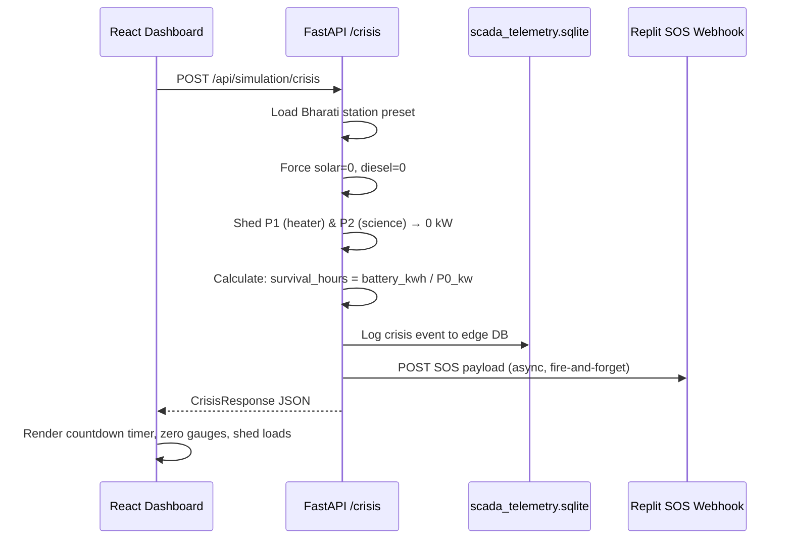

# POLARIS Architecture Schema v3.0

## AI-Driven Smart Energy Management System & Digital Twin for Polar Research Stations
### Smart India Hackathon 2026 — Problem Statement PS26061

---

## 1. Project Structure

```
Polaris_Latest/
├── architecture_schema_v3.md          ← THIS FILE (Single Source of Truth)
│
├── backend/
│   ├── main.py                        # FastAPI entrypoint — registers ALL routers
│   ├── requirements.txt               # Python dependencies (fastapi, httpx, ortools, etc.)
│   ├── .env.example                   # Environment variables (incl. REPLIT_WEBHOOK_URL)
│   │
│   ├── api/                           # REST & WebSocket API layer
│   │   ├── station.py                 # GET /api/station/presets, POST /api/station/calculate-state
│   │   ├── weather.py                 # GET /api/weather/live
│   │   ├── forecast.py                # POST /api/forecast/run
│   │   ├── optimization.py            # POST /api/optimization/solve
│   │   ├── simulation.py              # POST /api/simulation/run, WS /api/simulation/ws/stream
│   │   ├── crisis.py                  # POST /api/simulation/crisis ← NEW (Catastrophic Crisis)
│   │   └── agents.py                  # POST /api/agents/orchestrate
│   │
│   ├── database/
│   │   ├── db.py                      # Primary SQLite connection (polaris.db)
│   │   ├── schema.py                  # Core schema: stations, telemetry, quality tables
│   │   └── edge_db.py                 # Edge-resilience SQLite layer ← NEW
│   │
│   ├── data/
│   │   ├── polaris.db                 # Primary operational database
│   │   ├── weather_cache.sqlite       # Edge DB: cached Open-Meteo forecasts ← NEW
│   │   ├── scada_telemetry.sqlite     # Edge DB: SCADA sensor + crisis event log ← NEW
│   │   ├── historical_telemetry.csv   # 15,000+ synthetic katabatic edge-cases
│   │   └── station_presets.py         # Polar station configurations (Bharati, Maitri, etc.)
│   │
│   ├── simulation/
│   │   ├── engine.py                  # Dual-track simulation (Baseline SCADA vs Polaris AI)
│   │   └── scenarios.py               # Disaster scenario definitions
│   │
│   ├── optimization/
│   │   └── energy_optimizer.py        # Google OR-Tools MILP solver
│   │
│   ├── physics/
│   │   └── polar_physics.py           # Arrhenius RTE, rime ice, CHP, parasitic heater
│   │
│   ├── forecasting/                   # AI forecasting pipeline
│   ├── services/                      # Weather, solar, load, optimizer services
│   ├── agents/                        # Multi-agent orchestration (Forecast, Energy Mgr, Safety)
│   └── scripts/                       # Utility scripts
│
├── frontend/
│   ├── src/
│   │   ├── App.tsx                    # Root application — state management & routing
│   │   ├── main.tsx                   # Vite entrypoint
│   │   ├── index.css                  # Global styles
│   │   │
│   │   ├── api/
│   │   │   └── client.ts             # REST API client (incl. triggerCrisis())
│   │   │
│   │   ├── components/
│   │   │   ├── Header.tsx             # Navigation & resilience indicator
│   │   │   ├── CurrentEnergyCard.tsx   # Microgrid KPIs + CRISIS COUNTDOWN TIMER
│   │   │   ├── LoadManagement.tsx      # P0/P1/P2 dispatch table + crisis shedding UI
│   │   │   ├── EnergyFlow.tsx          # Sankey-style energy flow diagram
│   │   │   ├── DigitalTwin.tsx         # 3D render canvas
│   │   │   ├── SimulationControls.tsx  # Playback controls
│   │   │   ├── BaselineComparison.tsx  # Dual-track comparison charts
│   │   │   ├── AgentActivity.tsx       # Multi-agent log feed
│   │   │   ├── ForecastChart.tsx       # Solar/load forecast charts
│   │   │   ├── WeatherPanel.tsx        # Live atmospheric telemetry
│   │   │   ├── StationMap.tsx          # Leaflet coordinate selector
│   │   │   ├── StationConfig.tsx       # Equipment configuration panel
│   │   │   ├── OptimizationTimeline.tsx # 24h optimal schedule
│   │   │   ├── ExplainabilityModal.tsx  # Decision transparency modal
│   │   │   ├── FinalReportModal.tsx     # End-of-simulation report
│   │   │   ├── DataSourcesFooter.tsx    # Data lineage + AI pipeline specs
│   │   │   └── PolarisDashboard.tsx     # WebSocket SCADA dashboard
│   │   │
│   │   ├── pages/
│   │   │   ├── Dashboard.tsx           # Control tab — config + telemetry + crisis button
│   │   │   ├── Simulation.tsx          # Simulation tab — dual-track playback
│   │   │   └── Forecast.tsx            # Forecast tab — AI predictions
│   │   │
│   │   ├── store/
│   │   │   └── usePolarisStore.ts      # Zustand WebSocket state
│   │   │
│   │   └── types/
│   │       └── index.ts                # TypeScript type definitions (incl. CrisisResponse)
│   │
│   ├── index.html
│   ├── vite.config.ts
│   ├── tailwind.config.js
│   ├── postcss.config.js
│   ├── tsconfig.json
│   └── package.json
```

---

## 2. Catastrophic Crisis Endpoint

### Route Definition

| Method | Path | Router | File |
|--------|------|--------|------|
| `POST` | `/api/simulation/crisis` | `crisis.router` | `backend/api/crisis.py` |

### Execution Flow



### Response Contract

```json
{
  "status": "CRITICAL_SOS",
  "station": "Bharati Research Station",
  "fault": "Total Generation Failure",
  "timestamp": "2026-09-04T22:20:00Z",
  "generation": {
    "solar_kw": 0,
    "diesel_kw": 0,
    "total_kw": 0
  },
  "battery": {
    "capacity_kwh": 600,
    "soc_pct": 75,
    "available_energy_kwh": 450,
    "status": "SOLE_POWER_SOURCE"
  },
  "load_hierarchy": {
    "p0_life_support": {
      "loads": [
        {"id": "heat_life", "name": "Habitat & Life Support Thermal", "power_kw": 55.0, "status": "ACTIVE"},
        {"id": "comm_nav", "name": "Satellite Uplink & Comms", "power_kw": 12.0, "status": "ACTIVE"},
        {"id": "life_support", "name": "Water Purification & Air Scrubbers", "power_kw": 18.0, "status": "ACTIVE"}
      ],
      "total_kw": 85.0,
      "status": "FULLY_POWERED"
    },
    "p1_bess_heating": {
      "loads": [
        {"id": "battery_heater", "name": "BESS Thermal Management", "power_kw": 0, "rated_kw": 15.0, "status": "SHED"}
      ],
      "total_kw": 0,
      "status": "SHED_TO_ZERO"
    },
    "p2_science_rover": {
      "loads": ["...all IMPORTANT and DEFERRABLE loads with status: SHED"],
      "total_kw": 0,
      "status": "SHED_TO_ZERO"
    }
  },
  "survival": {
    "p0_load_kw": 85.0,
    "p0_exergy_remaining_hours": 5.29,
    "p0_exergy_remaining_minutes": 317,
    "runway_display": "5 Hours 17 Minutes"
  },
  "webhook": {
    "url": "https://...",
    "fired": true,
    "response_status": 200
  },
  "edge_databases": {
    "weather_cache": "weather_cache.sqlite",
    "scada_telemetry": "scada_telemetry.sqlite",
    "crisis_logged": true
  }
}
```

---

## 3. Load Priority Hierarchy (P0 / P1 / P2)

The POLARIS system enforces a strict 3-tier load shedding protocol during energy crises:

| Priority | Name | Description | Shedding Policy | Bharati Default |
|----------|------|-------------|-----------------|-----------------|
| **P0** | Life Support | Non-negotiable human survival loads: habitat thermal, comms, water/air | **NEVER SHED** — powered until battery depletion | 85 kW |
| **P1** | BESS Heating | Battery thermal management (parasitic heater below -20°C) | Shed first in crisis — batteries sacrifice longevity for crew survival | 15 kW |
| **P2** | Science & Rover | All IMPORTANT (labs, lighting) and DEFERRABLE (HPC, water heating, rover) loads | Shed immediately — zero scientific/operational loads | 127 kW |

### Thermal Death Calculation

```
Survival_Hours = Battery_Available_Energy_kWh / P0_Load_kW

Where:
  Battery_Available_Energy_kWh = battery_capacity_kwh × (battery_soc_pct / 100)
  P0_Load_kW = sum(load.power_kw for load in station.loads if load.priority == "CRITICAL")
```

For Bharati at 75% SoC: `450 kWh / 85 kW = 5.29 hours`

---

## 4. SOS Webhook Payload Contract

### Replit Webhook Configuration

| Parameter | Value |
|-----------|-------|
| Environment Variable | `REPLIT_WEBHOOK_URL` |
| Method | `POST` |
| Content-Type | `application/json` |
| Timeout | 10 seconds |
| Failure Mode | Fire-and-forget (logged but non-blocking) |

### Payload Schema

```json
{
  "status": "CRITICAL_SOS",
  "station": "Bharati",
  "fault": "Total Generation Failure",
  "p0_exergy_remaining_hours": 5.29,
  "timestamp": "2026-09-04T22:20:00Z",
  "battery_soc_pct": 75.0,
  "p0_load_kw": 85.0,
  "battery_energy_kwh": 450.0
}
```

---

## 5. Edge-Deployed SQLite Resilience Layer

POLARIS operates on edge-deployed hardware at polar research stations where connectivity is intermittent. Two additional SQLite databases provide local resilience:

### weather_cache.sqlite

| Table | Purpose |
|-------|---------|
| `cached_forecasts` | Stores Open-Meteo API responses with TTL for offline operation |

**Schema:**
```sql
CREATE TABLE cached_forecasts (
    id INTEGER PRIMARY KEY AUTOINCREMENT,
    station_id TEXT NOT NULL,
    latitude REAL,
    longitude REAL,
    forecast_json TEXT NOT NULL,
    fetched_at TEXT NOT NULL,
    expires_at TEXT NOT NULL,
    source TEXT DEFAULT 'open-meteo'
);
```

### scada_telemetry.sqlite

| Table | Purpose |
|-------|---------|
| `sensor_readings` | High-frequency SCADA sensor data (voltage, current, temperature) |
| `crisis_events` | Immutable log of all SOS/crisis activations |

**Schema:**
```sql
CREATE TABLE sensor_readings (
    id INTEGER PRIMARY KEY AUTOINCREMENT,
    timestamp TEXT NOT NULL,
    station_id TEXT NOT NULL,
    sensor_type TEXT NOT NULL,
    value REAL,
    unit TEXT,
    quality TEXT DEFAULT 'GOOD'
);

CREATE TABLE crisis_events (
    id INTEGER PRIMARY KEY AUTOINCREMENT,
    timestamp TEXT NOT NULL,
    station_id TEXT NOT NULL,
    fault_type TEXT NOT NULL,
    p0_load_kw REAL,
    battery_soc_pct REAL,
    survival_hours REAL,
    webhook_fired INTEGER DEFAULT 0,
    webhook_response TEXT
);
```

---

## 6. AI Pipeline Specifications

| Parameter | Value |
|-----------|-------|
| **Training Corpus** | 15,000+ Synthetic Katabatic Edge-Cases (PINN) |
| **Optimization Solver** | Google OR-Tools SCIP MILP |
| **Weather Data Source** | Open-Meteo High-Resolution Atmospheric API |
| **Physics Engine** | Arrhenius RTE + Rime Ice + CHP Waste Heat Recovery |
| **Advisory LLM** | Qwen3:8B via Ollama (edge-deployable) |
| **Edge Persistence** | 3× SQLite (polaris.db, weather_cache.sqlite, scada_telemetry.sqlite) |

---

*Document Version: 3.0 — Catastrophic Crisis Workflow Update*
*Last Updated: September 2026*
*System: POLARIS AI Polar Energy Digital Twin*
*Problem Statement: PS26061 — Smart India Hackathon 2026*
